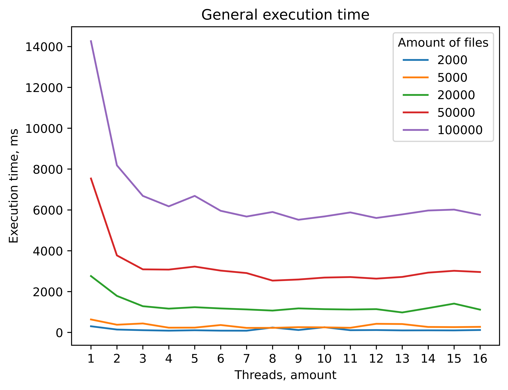

# Table of contents
- [Description](#Description)
    * [Usage example](#Usage-example)
- [Requirements](#Requirements)
- [Project structure](#Project-structure)
    * [Top-level directory](#Top-level-directory)
    * [Placing test sets in parent directory](#Placing-test-sets-in-parent-directory)
- [Project setup](#Project-setup)
    * [Cloning repository](#Cloning-repository)
    * [Data preparation](#Data-preparation)
    * [Compiling source files](#Compiling-source-files)
    * [Running programs after compiling](#Running-programs-after-compiling)
- [Graphical results](#Graphical-results)

# Description
This is a repository that holds source code for creating an inverted index as a mandatory project of "Parallel computing" course.

Inverted index is built on the data which is stored in "./data/" folder, using the stop words (have to be skipped) that are stored in "./assets/stop-words.txt".

_Amount of threads used to build an inverted index can vary._

_If loadFile is "true", inverted index is loaded from serialized "./assets/inverted-index.ser" file._

_If writeFile is "true", serialized inverted index is written to "./assets/inverted-index.ser" file._
 
### Usage example:
```java
int threadAmount = 1;
boolean loadFile = false;
boolean writeFile = true;
Indexer invertedIndex = new Indexer("path/to/stop-words.txt", threadAmount, loadFile, writeFile);
invertedIndex.buildIndex("data/directory");

String query = "word1 word2 ...";
// obtain a map for each word in the client query string
Map<String, List<String>> wordsLocations = invertedIndex.locateEach(query);
```

# Requirements
- Java 15.0.2
- Python 3.8
    - matplotlib 3.3.0

# Project structure
### Top-level directory
    .                                           # Current directory
    ├── assets                                  # Utility files
    │   ├── screenshots                         # Plots of execution time curves
    │   ├── stop-words.txt                      # Words that are skipped in the inverted index
    │   └── inverted-index.ser                  # Recent serialized inverted index
    ├── data                                    # .txt files
    ├── java                                    # Java source files
    │   ├── out                                 # Appears after compiling
    │   └── src                                 # Packages
    │       ├── IndexClient     
    │       │   └── Client.java                 # Client that uses index
    │       ├── IndexServer
    │       │   ├── Indexer.java                # Builds an inverted index
    │       │   └── Server.java                 # Server that uses inverted index and handles clients
    │       └── Utility
    │           ├── CustomLogger.java           # Logging for classes
    │           ├── ExecutionTesting.java       # Inverted index building time measurement
    │           └── IOStreamManager.java        # Helps with server-client interaction  
    ├── logs                                    # Logs for Server and Client(s)
    ├── python                                  # Python source files
    │   └── ExecutionTimeVisuzalier.py          # Script that plots execution time curves
    └── README.md

### Placing test sets in parent directory
    ..                                          # Parent directory
    ├── test-sets                               # Executing time measurement (not stored in repository)
    │       ├── time-test-set-2000              # 2000 .txt files
    │       ├── time-test-set-5000              # 5000 .txt files  
    │       ├── time-test-set-20000             # 20000 .txt files  
    │       ├── time-test-set-50000             # 50000 .txt files 
    │       └── time-test-set-100000            # 100000 .txt files 
    └── .                                       # Current directory
        ├── assets
        ├── data        
        ├── java        
        ├── logs 
        ├── python
        └── README.md

# Project setup
### Cloning repository
```sh
git clone https://github.com/sergey-judi/course-work-pc.git
cd course-work-pc
```

### Data preparation
Inverted index is built on the data stored in "./data/" folder, reducing source text using "./assets/stop-words.txt" file.

So,
- place .txt files in "./data/" folder
- add or delete stop words from "./assets/stop-words.txt"

### Compiling source files
In the working directory _(course-work-pc)_ execute the following command in terminal:
```sh
javac -d java/out java/src/*/*.java
```

### Running programs after compiling
After compiling files successfully execute the following commands:
- To use index built for data placed to the _data_ folder
    1. run java server
        ```sh
        java -cp java/out src.IndexServer.Server
        ```
    2. run java client
        ```sh
        java -cp java/out src.IndexClient.Client
        ```
    After running this commands, use following client's instructions.

- To test index building time using 1 to 16 threads for data placed to ("\../test-sets/time-test-set-_i_.txt", i={2000, 5000, 20000, 50000, 100000})
    1. run java server
        ```sh
        java -cp java/out src.Utility.ExecutionTesting
        ```
    2. run python client
        ```sh
        python python/ExecutinTimeVisualizer.py
        ```
    Check "./assets/screenshots/" for plots built after execution finishing.

# Graphical results
### Execution time plots for inverted index built on different amount of files running on different amount of threads
- Using __CopyOnWriteArrayList__ data structure as thread-safe collection for inverted index
    
- Using __ConcurrentLinkedQueue__ data structure as thread-safe collection for inverted index
    

For more detailed results see [graphical results](./assets/screenshots/GRAPHICAL-RESULTS.md).
