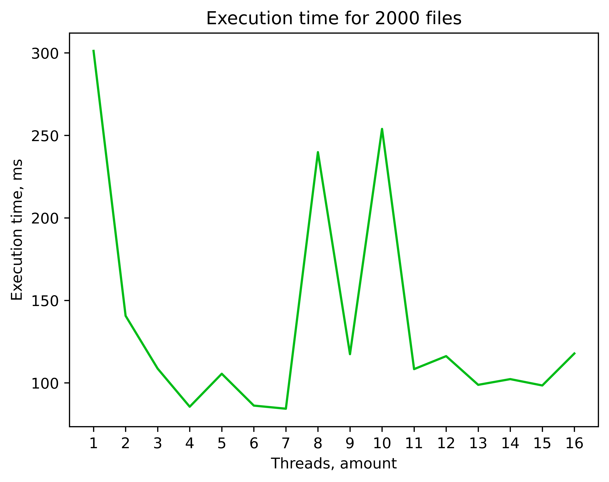
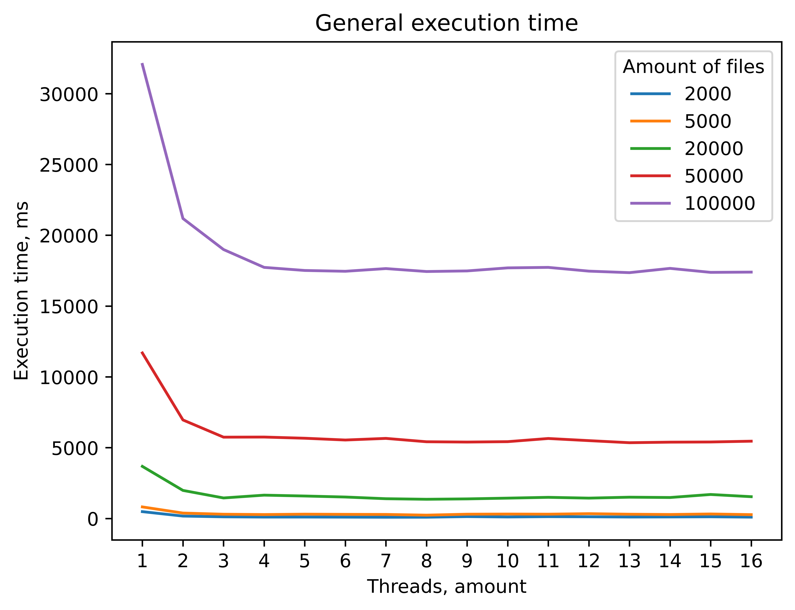

# Graphical results
Execution time plots for inverted index built on different amount of files running on different amount of threads
## Table of contents
- [Index built for 2000 files](#Index-built-for-2000-files)
- [Index built for 5000 files](#Index-built-for-5000-files)
- [Index built for 20000 files](#Index-built-for-20000-files)
- [Index built for 50000 files](#Index-built-for-50000-files)
- [Index built for 100000 files](#Index-built-for-100000-files)
- [General](#General)

### Index built for 2000 files
- Using __CopyOnWriteArrayList__ data structure as thread-safe collection for inverted index
    
- Using __ConcurrentLinkedQueue__ data structure as thread-safe collection for inverted index
    

### Index built for 5000 files
- Using __CopyOnWriteArrayList__ data structure as thread-safe collection for inverted index
    
- Using __ConcurrentLinkedQueue__ data structure as thread-safe collection for inverted index
    

### Index built for 20000 files
- Using __CopyOnWriteArrayList__ data structure as thread-safe collection for inverted index
    
- Using __ConcurrentLinkedQueue__ data structure as thread-safe collection for inverted index
    

### Index built for 50000 files
- Using __CopyOnWriteArrayList__ data structure as thread-safe collection for inverted index
    
- Using __ConcurrentLinkedQueue__ data structure as thread-safe collection for inverted index
    

### Index built for 100000 files
- Using __CopyOnWriteArrayList__ data structure as thread-safe collection for inverted index
    
- Using __ConcurrentLinkedQueue__ data structure as thread-safe collection for inverted index
    

### General
- Using __CopyOnWriteArrayList__ data structure as thread-safe collection for inverted index
    
- Using __ConcurrentLinkedQueue__ data structure as thread-safe collection for inverted index
    
